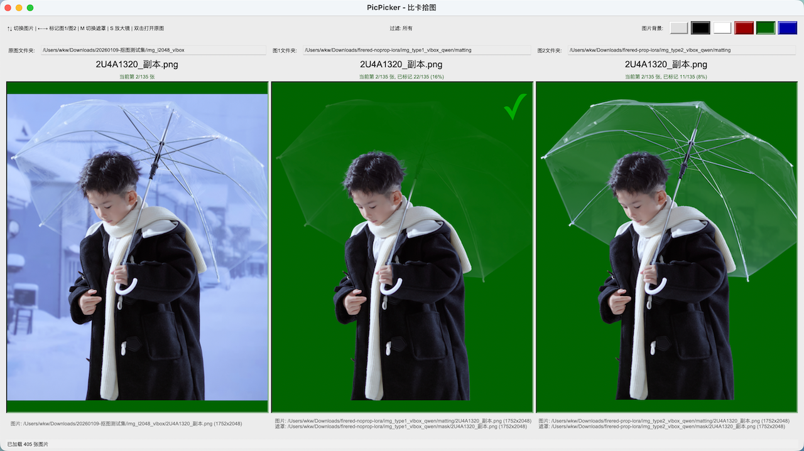

# 比卡拾图 PicPicker

比卡拾图用于最多三个图片文件夹并排对比、逐张同步浏览，适合质检、选图与版本对比。



## 关于 AI vibe coding

本项目从需求整理、技术选型到功能设计与实现，完整采用 AI 辅助的 vibe coding 方式推进：通过在 `spec.md` 中逐步迭代需求与细节，再由 AI 生成与修订代码，实现了几乎全程「对话驱动开发」。你可以将 `spec.md` 视作本项目的「设计蓝本」，其中记录了功能目标、交互细节以及若干实现思路，代码则是在这一蓝本的基础上由 AI 持续补全与打磨。

## 前置要求

- Python >= 3.11
- [uv](https://github.com/astral-sh/uv)
- [just](https://github.com/casey/just)

## 安装

```bash
just install        # 安装依赖
just install-dev    # 安装开发依赖
```

## 使用

运行 GUI：

```bash
uv run picpicker
# 或
just run
```

主要功能：

- 三栏同步预览（原图 / 图1 / 图2）与上下翻页
- 图1、图2 标记及已选数量/占比统计
- 导出与从 CSV 导入标记
- 图1、图2 遮罩文件夹绑定与切换
- 按标记导出原图与图1/图2、遮罩为 ZIP
- 放大镜、标记过滤、图片列表小窗、盲选模式
